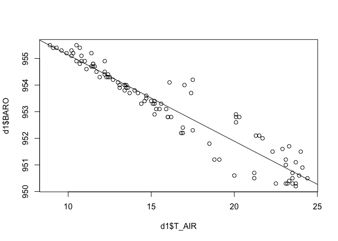

---
title: Using the dataone R package
author: Jones, Leinfelder
output:
  html_document:
    toc: false
    highlight: default
---  

The `dataone` package provides classes for reading and writing data from DataONE repositories.  We demonstrate how to connect to DataONE, query to locate data of interest, and how to then use the identifiers of that data to access both the data files and the associated metadata.  We then load the data as a data.frame.


```r
library(dataone)

mn_nodeid <- "urn:node:mnTestKNB"
#mn_nodeid <- "urn:node:mnDemo9"
```

## Create a client 

The DataONE package uses a client of the class `D1Client` to communicate with the system.  The `D1Client` communicates with the DataONE network of Member Nodes when a user requests to read or write data.


```r
# cli <- D1Client()
cli <- D1Client("STAGING2")
setMNodeId(cli, mn_nodeid)
```

## Search for data

Once we have a client (`cli`), we can use it to search for data packages, and only request versions that have not been replaced by a newer version (`-obsoletedBy:*`). The search syntax follows the [SOLR/Lucene query syntax](http://lucene.apache.org/core/3_6_0/queryparsersyntax.html).  DataONE provides a list of searchable fields which have been extracted from the metadata of all of their data packages. In this example, we request any data set with metadata matching `Meteorologicos`, and we ask that the `identifier`, `title`, `author`, `documents`, and `resourceMap` fields be returned.


```r
results <- d1SolrQuery(cli, list(q="Meteorologicos -obsoletedBy:*",fl="identifier,title,author,documents,resourceMap"))
sr <- xmlParse(results)
sr
```

```
## <?xml version="1.0" encoding="UTF-8"?>
## <response>
##   <lst name="responseHeader">
##     <int name="status">0</int>
##     <int name="QTime">5</int>
##     <lst name="params">
##       <str name="fl">identifier,title,author,documents,resourceMap</str>
##       <str name="q">Meteorologicos -obsoletedBy:*</str>
##     </lst>
##   </lst>
##   <result name="response" numFound="1" start="0">
##     <doc>
##       <str name="author">Rodrigo Torrens</str>
##       <arr name="documents">
##         <str>doi:10.5063/AA/tao.2.1</str>
##       </arr>
##       <str name="identifier">doi:10.5063/AA/tao.1.1</str>
##       <arr name="resourceMap">
##         <str>resourceMap_tao.1.1</str>
##       </arr>
##       <str name="title">Datos Meteorologicos</str>
##     </doc>
##   </result>
## </response>
## 
```

## Data Packages

Often a data set will consist of many files, and individually examining search output to find each of them can be tedious.  We can make use of the DataONE DataPackage metadata to determine which data and metadata files are contained in the data set, and then list the identifiers for those.


```r
pkg <- getPackage(cli, "resourceMap_tao.1.1")
getIdentifiers(pkg)
```

```
## [1] "doi:10.5063/AA/tao.1.1" "doi:10.5063/AA/tao.2.1"
```


## Download metadata

Each data package can also have associated science metadata, which we retrieve in the same way as the data objects.  But in this case, the metadata returned is in XML format, for which we can use a standard XML parser to manipulate the metadata.


```r
obj4 <- getMember(pkg, "doi:10.5063/AA/tao.1.1")
getFormatId(obj4)
```

```
## [1] "eml://ecoinformatics.org/eml-2.0.0"
```

```r
metadata <- xmlParse(getData(obj4))
```

## Inspect the data attributes (columns)

With the metadata parsed, we can now extract and print a list of all attribute names in the metadata (and any other metadata field that was encoded in the metadata document).  See the [EML Specification](https://knb.ecoinformatics.org/software/eml) for details on the possible fields in a metadata document.


```r
attList <- sapply(getNodeSet(metadata, "//attributeName"), xmlValue)
attList
```

```
##  [1] "DATE"    "TIME"    "T_AIR"   "RH"      "DEW"     "BARO"    "WD"     
##  [8] "WS"      "RAIN"    "SOL"     "SOL_SUM"
```

```r
attDefList <- sapply(getNodeSet(metadata, "//attributeDefinition"), xmlValue)
attDefList
```

```
##  [1] "Date of collection"           "Time of collection"          
##  [3] "Air temperature"              "Relative Humidity"           
##  [5] "Dew point"                    "Barometric preasure"         
##  [7] "Wind direction"               "Wind speed"                  
##  [9] "Amount of Rain"               "Solar radiation"             
## [11] "Solar radiation accumulation"
```

## Load it as EML

Alternatively, we can use the `EML` package to parse the EML document and gain access to its contents through convenient parsing methods. The `EML` package is aware of the `dataone` package and will use it to load metadata from the DataONE network.


```r
library(EML)
eml <- eml_read("doi:10.5063/AA/tao.1.1")
eml_get(eml, "id")
```

```
## [1] "tao.1.1"
```

```r
eml_get(eml, "version")
```

```
## [1] "eml://ecoinformatics.org/eml-2.0.0"
```

```r
eml_get(eml, "creator")
```

```
## [1] "Rodrigo Torrens [cre]"
```

```r
eml_get(eml, "citation_info")
```

```
## Torrens R (2014-08-15). _Datos Meteorologicos_.
```

# Accessing the Data

Now let's look at the actual data in this package, accessible via the DataONE client.

## Directly fetch data

Inspecting the search output above, one can see data packages, their identifiers, and identifiers of both the metadata and component data files that comprise the data package.  We can download one of the data files listed in the search results, and convert it to a data frame if we know it is a CSV file.


```r
obj0 <- getD1Object(cli, "doi:10.5063/AA/tao.2.1")
d0 <- asDataFrame(obj0)
head(d0)
```

```
##       DATE  TIME T_AIR RH  DEW  BARO  WD  WS RAIN SOL SOL_SUM
## 1 01/01/01 00:00  15.0 99 14.5 953.4  99 0.8    0   0       0
## 2 01/01/01 01:00  13.4 99 12.8 953.8 100 1.9    0   0       0
## 3 01/01/01 02:00  13.4 99 12.8 954.0 114 1.2    0   0     120
## 4 01/01/01 03:00  12.4 99 12.3 954.3 114 2.5    0   0       0
## 5 01/01/01 04:00  11.7 99 11.7 954.5  96 3.1    0   0     120
## 6 01/01/01 05:00  11.4 99 11.2 954.7  85 2.6    0   0       0
```

## Get data from a package

Once a DataPackage has been downloaded, its data objects are local and we can request each of the items from the package using its identifier.  Below, we get the data for two identified data files, and create data frames for each of the data objects as we know they are CSV format (which can be determined from the object format type).


## Use the data for something interesting

Simple summary statistics can easily be shown with R


```r
min(d1$T_AIR)
```

```
## [1] 8.9
```

```r
max(d1$T_AIR)
```

```
## [1] 24.4
```

```r
mean(d1$T_AIR)
```

```
## [1] 16.06
```

## Plot the data

Air temperature and barometric pressure seem to be inversely related.


```r
res <- lm(d1$BARO ~ d1$T_AIR)
plot(d1$T_AIR, d1$BARO)
abline(res)
```

 
