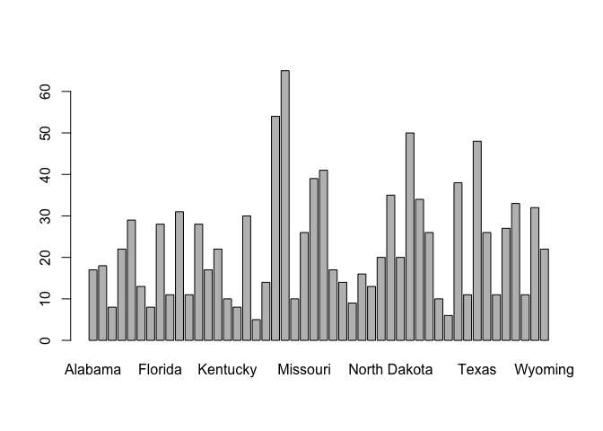
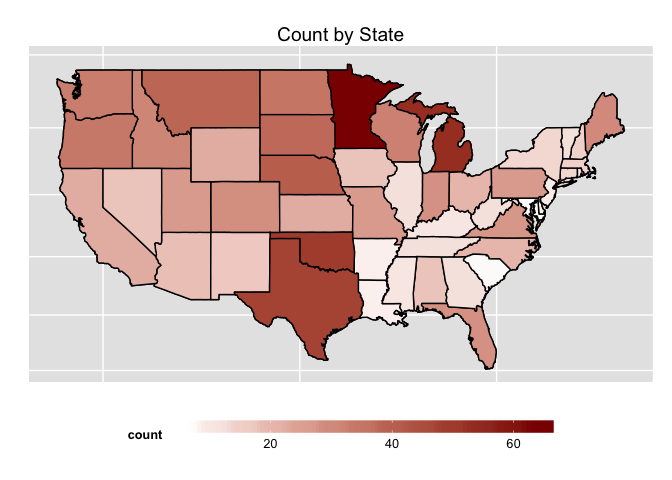

---
title: Using the dataone R package
author: Jones, Leinfelder
output:
  html_document:
    toc: false
    highlight: default
---  

The `dataone` package provides classes for reading and writing data from DataONE repositories.  We demonstrate how to connect to DataONE, query to locate data of interest, and how to then use the identifiers of that data to access both the data files and the associated metadata.  We then load the data as a data.frame.


```r
library(dataone)

mn_nodeid <- "urn:node:mnTestGLEON"
#mn_nodeid <- "urn:node:mnDemo9"
```

## Create a client 

The DataONE package uses a client of the class `D1Client` to communicate with the system.  The `D1Client` communicates with the DataONE network of Member Nodes when a user requests to read or write data.


```r
# cli <- D1Client()
cli <- D1Client("STAGING")
setMNodeId(cli, mn_nodeid)
```

## Search for data

Once we have a client (`cli`), we can use it to search for data packages, and only request versions that have not been replaced by a newer version (`-obsoletedBy:*`). The search syntax follows the [SOLR/Lucene query syntax](http://lucene.apache.org/core/3_6_0/queryparsersyntax.html).  DataONE provides a list of searchable fields which have been extracted from the metadata of all of their data packages. In this example, we request any data set with metadata matching `Meteorologicos`, and we ask that the `identifier`, `title`, `author`, `documents`, and `resourceMap` fields be returned.


```r
results <- d1SolrQuery(cli, list(q="datasource:\"urn:node:mnTestGLEON\" +formatType:METADATA -obsoletedBy:*",fl="identifier,title,author,documents,resourceMap"))
sr <- xmlParse(results)
sr
```

```
## <?xml version="1.0" encoding="UTF-8"?>
## <response>
##   <lst name="responseHeader">
##     <int name="status">0</int>
##     <int name="QTime">8</int>
##     <lst name="params">
##       <str name="fl">identifier,title,author,documents,resourceMap</str>
##       <str name="q">datasource:"urn:node:mnTestGLEON" +formatType:METADATA -obsoletedBy:*</str>
##     </lst>
##   </lst>
##   <result name="response" numFound="5" start="0">
##     <doc>
##       <str name="author">Emily Read</str>
##       <arr name="documents">
##         <str>cgries.14.2</str>
##       </arr>
##       <str name="identifier">cgries.16.1</str>
##       <arr name="resourceMap">
##         <str>resourceMap_cgries.16.1</str>
##       </arr>
##       <str name="title">2007 Environmental Protection Agency (EPA) National Lakes Assessment dataset plus derived data and additional spatially explicit ancillary environmental data.</str>
##     </doc>
##     <doc>
##       <str name="author">Paul Hanson</str>
##       <arr name="documents">
##         <str>cgries.8.1</str>
##         <str>cgries.5.1</str>
##         <str>cgries.9.1</str>
##         <str>cgries.6.1</str>
##         <str>cgries.10.1</str>
##         <str>cgries.7.1</str>
##         <str>cgries.11.1</str>
##       </arr>
##       <str name="identifier">gleon.1.9</str>
##       <arr name="resourceMap">
##         <str>resourceMap_gleon.1.9</str>
##       </arr>
##       <str name="title">Fluxes project at North Temperate Lakes LTER: Random lake survey 2004</str>
##     </doc>
##     <doc>
##       <str name="author">Alicia Caruso</str>
##       <arr name="documents">
##         <str>cgries.12.1</str>
##       </arr>
##       <str name="identifier">cgries.13.1</str>
##       <arr name="resourceMap">
##         <str>resourceMap_cgries.13.1</str>
##       </arr>
##       <str name="title">Academic and non-academic uses of GLEON buoy data, questionaire, 2013</str>
##     </doc>
##     <doc>
##       <str name="author">Emily Read</str>
##       <arr name="documents">
##         <str>cgries.4.1</str>
##         <str>cgries.3.1</str>
##       </arr>
##       <str name="identifier">gleon.2.4</str>
##       <arr name="resourceMap">
##         <str>resourceMap_gleon.2.4</str>
##       </arr>
##       <str name="title">Microbial Observatory at North Temperate Lakes LTER Time series of bacterial community dynamics in Lake Mendota 2000 - 2009</str>
##     </doc>
##     <doc>
##       <str name="author">Corinna Gries</str>
##       <arr name="documents">
##         <str>cgries.22.1</str>
##       </arr>
##       <str name="identifier">cgries.23.1</str>
##       <arr name="resourceMap">
##         <str>resourceMap_cgries.23.1</str>
##       </arr>
##       <str name="title">Lake Mendota hourly water temperature profile 2013</str>
##     </doc>
##   </result>
## </response>
## 
```

## Data Packages

Often a data set will consist of many files, and individually examining search output to find each of them can be tedious.  We can make use of the DataONE DataPackage metadata to determine which data and metadata files are contained in the data set, and then list the identifiers for those.


```r
pkg <- getPackage(cli, "resourceMap_cgries.16.1")
getIdentifiers(pkg)
```

```
## [1] "cgries.14.2" "cgries.16.1"
```


## Download metadata

Each data package can also have associated science metadata, which we retrieve in the same way as the data objects.  But in this case, the metadata returned is in XML format, for which we can use a standard XML parser to manipulate the metadata.


```r
obj4 <- getMember(pkg, "cgries.16.1")
getFormatId(obj4)
```

```
## [1] "eml://ecoinformatics.org/eml-2.1.1"
```

```r
metadata <- xmlParse(getData(obj4))
```

## Inspect the data attributes (columns)

With the metadata parsed, we can now extract and print a list of all attribute names in the metadata (and any other metadata field that was encoded in the metadata document).  See the [EML Specification](https://knb.ecoinformatics.org/software/eml) for details on the possible fields in a metadata document.


```r
attList <- sapply(getNodeSet(metadata, "//attributeName"), xmlValue)
attList
```

```
##   [1] "SITE_ID"                "SITE_TYPE"             
##   [3] "VISIT_NO.x"             "DATE_COL"              
##   [5] "REPEAT"                 "LON_DD.x"              
##   [7] "LAT_DD.x"               "ALBERS_X"              
##   [9] "ALBERS_Y"               "FLD_LON_DD"            
##  [11] "FLD_LAT_DD"             "FLD_FLAG"              
##  [13] "ST.x"                   "STATE_NAME"            
##  [15] "CNTYNAME"               "EPA_REG.x"             
##  [17] "NHDNAME"                "LAKENAME"              
##  [19] "AREA_CAT7.x"            "BASINAREA_KM2"         
##  [21] "BASINAREA_HA"           "BASINAREA_LU_KM2"      
##  [23] "URBAN.x"                "ECO_LEV_3.x"           
##  [25] "ECO_L3_NAM"             "NUT_REG.x"             
##  [27] "NUTREG_NAME.x"          "ECO_NUTA.x"            
##  [29] "LAKE_ORIGIN.x"          "AREA_HA"               
##  [31] "SIZE_CLASS"             "LAKEAREA"              
##  [33] "LAKEPERIM"              "SLD"                   
##  [35] "DEPTH_X"                "DEPTHMAX"              
##  [37] "ELEV_PT"                "HUC_2.x"               
##  [39] "HUC_8.x"                "REACHCODE"             
##  [41] "OmernikLevel_II"        "PTL"                   
##  [43] "NTL"                    "TURB"                  
##  [45] "ANC"                    "DOC"                   
##  [47] "COND"                   "CHLA"                  
##  [49] "PTL_COND"               "NTL_COND"              
##  [51] "CHLA_COND"              "TURB_COND"             
##  [53] "ANC_COND"               "SALINITY_COND"         
##  [55] "DISTANCE_BUFR"          "BUFFERAREA_KM2"        
##  [57] "BUFFERAREA_HA"          "MISSDATA_KM2_BUFR"     
##  [59] "NLCD11_KM2_BUFR"        "NLCD12_KM2_BUFR"       
##  [61] "NLCD21_KM2_BUFR"        "NLCD22_KM2_BUFR"       
##  [63] "NLCD23_KM2_BUFR"        "NLCD24_KM2_BUFR"       
##  [65] "NLCD31_KM2_BUFR"        "NLCD32_KM2_BUFR"       
##  [67] "NLCD41_KM2_BUFR"        "NLCD42_KM2_BUFR"       
##  [69] "NLCD43_KM2_BUFR"        "NLCD51_KM2_BUFR"       
##  [71] "NLCD52_KM2_BUFR"        "NLCD71_KM2_BUFR"       
##  [73] "NLCD72_KM2_BUFR"        "NLCD73_KM2_BUFR"       
##  [75] "NLCD74_KM2_BUFR"        "NLCD81_KM2_BUFR"       
##  [77] "NLCD82_KM2_BUFR"        "NLCD90_KM2_BUFR"       
##  [79] "NLCD91_KM2_BUFR"        "NLCD92_KM2_BUFR"       
##  [81] "NLCD93_KM2_BUFR"        "NLCD94_KM2_BUFR"       
##  [83] "NLCD95_KM2_BUFR"        "NLCD96_KM2_BUFR"       
##  [85] "NLCD97_KM2_BUFR"        "NLCD98_KM2_BUFR"       
##  [87] "NLCD99_KM2_BUFR"        "LANDUSE_KM2_BUFR"      
##  [89] "PCT_OPENH20_BUFR"       "PCT_ICESNOW_BUFR"      
##  [91] "PCT_WATER_BUFR"         "PCT_DEVOPEN_BUFR"      
##  [93] "PCT_DEVLOW_BUFR"        "PCT_DEVMED_BUFR"       
##  [95] "PCT_DEVHIGH_BUFR"       "PCT_DEVELOPED_BUFR"    
##  [97] "PCT_BARREN_BUFR"        "PCT_DECID_BUFR"        
##  [99] "PCT_CONIF_BUFR"         "PCT_MIXED_BUFR"        
## [101] "PCT_FOREST_BUFR"        "PCT_SHRUBLAND_BUFR"    
## [103] "PCT_GRASS_BUFR"         "PCT_PASTURE_BUFR"      
## [105] "PCT_CROPS_BUFR"         "PCT_AGRIC_BUFR"        
## [107] "PCT_WDYWET_BUFR"        "PCT_EMHERBWET_BUFR"    
## [109] "PCT_WETLAND_BUFR"       "NLCD11_KM2_BSN"        
## [111] "NLCD12_KM2_BSN"         "NLCD21_KM2_BSN"        
## [113] "NLCD22_KM2_BSN"         "NLCD23_KM2_BSN"        
## [115] "NLCD24_KM2_BSN"         "NLCD31_KM2_BSN"        
## [117] "NLCD32_KM2_BSN"         "NLCD41_KM2_BSN"        
## [119] "NLCD42_KM2_BSN"         "NLCD43_KM2_BSN"        
## [121] "NLCD51_KM2_BSN"         "NLCD52_KM2_BSN"        
## [123] "NLCD71_KM2_BSN"         "NLCD72_KM2_BSN"        
## [125] "NLCD73_KM2_BSN"         "NLCD74_KM2_BSN"        
## [127] "NLCD81_KM2_BSN"         "NLCD82_KM2_BSN"        
## [129] "NLCD90_KM2_BSN"         "NLCD91_KM2_BSN"        
## [131] "NLCD92_KM2_BSN"         "NLCD93_KM2_BSN"        
## [133] "NLCD94_KM2_BSN"         "NLCD95_KM2_BSN"        
## [135] "NLCD96_KM2_BSN"         "NLCD97_KM2_BSN"        
## [137] "NLCD98_KM2_BSN"         "NLCD99_KM2_BSN"        
## [139] "LANDUSE_KM2_BSN"        "PCT_OPENH20_BSN"       
## [141] "PCT_ICESNOW_BSN"        "PCT_WATER_BSN"         
## [143] "PCT_DEVOPEN_BSN"        "PCT_DEVLOW_BSN"        
## [145] "PCT_DEVMED_BSN"         "PCT_DEVHIGH_BSN"       
## [147] "PCT_DEVELOPED_BSN"      "PCT_BARREN_BSN"        
## [149] "PCT_DECID_BSN"          "PCT_CONIF_BSN"         
## [151] "PCT_MIXED_BSN"          "PCT_FOREST_BSN"        
## [153] "PCT_SHRUBLAND_BSN"      "PCT_GRASS_BSN"         
## [155] "PCT_PASTURE_BSN"        "PCT_CROPS_BSN"         
## [157] "PCT_AGRIC_BSN"          "PCT_WDYWET_BSN"        
## [159] "PCT_EMHERBWET_BSN"      "PCT_WETLAND_BSN"       
## [161] "BasinAreaToLakeArea_HA" "LakePerimToLakeArea"   
## [163] "mean.pct.imp_BUFR.1"    "mean.pct.imp_BSN"      
## [165] "pixels.w.impsurf_BSN"   "roadlen_BUFR"          
## [167] "roadDens_BUFR"          "roadlen_BSN"           
## [169] "roadDens_BSN"           "mean.min.dist_inBUFR"  
## [171] "mean.min.dist_inBSN"    "elev_stdev"            
## [173] "elev_maxmin"            "maxmin_elev_BUFR"      
## [175] "stdev_elev_BUFR"        "mean.pct.imp_BUFR"     
## [177] "pixels.w.impsurf_BUFR"  "Class"                 
## [179] "Class3"                 "Unstratified.1"        
## [181] "ResTime"                "SedToVolRatio"
```

```r
attDefList <- sapply(getNodeSet(metadata, "//attributeDefinition"), xmlValue)
attDefList
```

```
##   [1] "ID Assigned to Each Site"                                                                                                                                                                                                                                                                                                                  
##   [2] "PROB_Samp: Lake is from probability sample and can be used for population \nREF_Lake: Lake is not from probability sample and was selected as a candidate reference lake"                                                                                                                                                                  
##   [3] "Sequential Visit Number Within Year"                                                                                                                                                                                                                                                                                                       
##   [4] "Date Sample Collected"                                                                                                                                                                                                                                                                                                                     
##   [5] "Repeat visit lake (YES/blank)"                                                                                                                                                                                                                                                                                                             
##   [6] "Longitude (decimal degrees) obtained from NHD (NAD83)"                                                                                                                                                                                                                                                                                     
##   [7] "Latitude (decimal degrees) obtained from NHD (NAD83)"                                                                                                                                                                                                                                                                                      
##   [8] "x-coordinate from Albers projection (meters)"                                                                                                                                                                                                                                                                                              
##   [9] "y-coordinate from Albers projection (meters)"                                                                                                                                                                                                                                                                                              
##  [10] "Longitude (decimal degrees) recorded from the field form (lake verification)"                                                                                                                                                                                                                                                              
##  [11] "Latitude (decimal degrees) recorded from the field form (lake verification)"                                                                                                                                                                                                                                                               
##  [12] "Not NHD Lake-reference lake not found in NHD. Not in NHD lake polygon-field location was not found in NHD lake polygon"                                                                                                                                                                                                                    
##  [13] "State two letter code"                                                                                                                                                                                                                                                                                                                     
##  [14] "US state name"                                                                                                                                                                                                                                                                                                                             
##  [15] "County name"                                                                                                                                                                                                                                                                                                                               
##  [16] "EPA Region"                                                                                                                                                                                                                                                                                                                                
##  [17] "Lake name (from NHD)"                                                                                                                                                                                                                                                                                                                      
##  [18] "Lake name (from field forms)"                                                                                                                                                                                                                                                                                                              
##  [19] "Lake area unequal probability category (7 categories)"                                                                                                                                                                                                                                                                                     
##  [20] "Basin area (km2) from basin metric file"                                                                                                                                                                                                                                                                                                   
##  [21] "Basin area (hectares)"                                                                                                                                                                                                                                                                                                                     
##  [22] "Basin area (km2) from landuse file"                                                                                                                                                                                                                                                                                                        
##  [23] "URBAN LAKE? (YES/NO)"                                                                                                                                                                                                                                                                                                                      
##  [24] "Omernik level 3 ecoregion number"                                                                                                                                                                                                                                                                                                          
##  [25] "Omernik level 3 ecoregion name"                                                                                                                                                                                                                                                                                                            
##  [26] "Nutrient ecoregion, based on EPA nutrient criteria documents for lakes & reservoirs)"                                                                                                                                                                                                                                                      
##  [27] "Nutrient ecoregion name"                                                                                                                                                                                                                                                                                                                   
##  [28] "NLA Aggregate Nutrient Ecoregion"                                                                                                                                                                                                                                                                                                          
##  [29] "Lake origin (MAN-MADE, NATURAL [which includes natural lakes augmented by dams])"                                                                                                                                                                                                                                                          
##  [30] "Lake polygon area (hectares) from NHD"                                                                                                                                                                                                                                                                                                     
##  [31] "Lake area size class"                                                                                                                                                                                                                                                                                                                      
##  [32] "Lake polygon area (km2) from NHD"                                                                                                                                                                                                                                                                                                          
##  [33] "Lake polygon perimeter (km) from NHD"                                                                                                                                                                                                                                                                                                      
##  [34] "Shoreline development index (=LAKEPERIM/(2*sqrt(LAKEAREA*pi))"                                                                                                                                                                                                                                                                             
##  [35] "Lake Depth (m) at Index Site"                                                                                                                                                                                                                                                                                                              
##  [36] "Maximum Observed Lake Depth (m)"                                                                                                                                                                                                                                                                                                           
##  [37] "Site elevation (meters) from the National Elevation Dataset"                                                                                                                                                                                                                                                                               
##  [38] "Hydrologic region (2-digit)"                                                                                                                                                                                                                                                                                                               
##  [39] "Hydrologic region (8-digit)"                                                                                                                                                                                                                                                                                                               
##  [40] "Unique NHD 14-digit Reach Code (0=code not assigned in NHDPlus"                                                                                                                                                                                                                                                                            
##  [41] "From McDonald et al. 2013"                                                                                                                                                                                                                                                                                                                 
##  [42] "Total Phosphorus (ug/L)"                                                                                                                                                                                                                                                                                                                   
##  [43] "Total Nitrogen (ug/L)"                                                                                                                                                                                                                                                                                                                     
##  [44] "Turbidity (NTU)"                                                                                                                                                                                                                                                                                                                           
##  [45] "Gran ANC (ueq/L)"                                                                                                                                                                                                                                                                                                                          
##  [46] "Dissolved Organic Carbon (mg/L)"                                                                                                                                                                                                                                                                                                           
##  [47] "Conductivity (uS/cm @ 25 C)"                                                                                                                                                                                                                                                                                                               
##  [48] "Chlorophyll a concentration (µg/L).  Calculated as CHLA_ADJ*(40/VOL_FILTERED)"                                                                                                                                                                                                                                                             
##  [49] "UTRIENT CONDITION CLASS (TOTAL P)"                                                                                                                                                                                                                                                                                                         
##  [50] "NUTRIENT CONDITION CLASS (TOTAL N)"                                                                                                                                                                                                                                                                                                        
##  [51] "CONDITION CLASS (CHLOROPHYLL A)"                                                                                                                                                                                                                                                                                                           
##  [52] "CONDITION CLASS (TURBIDITY)"                                                                                                                                                                                                                                                                                                               
##  [53] "CHEMICAL CONDITION CLASS (ANC)"                                                                                                                                                                                                                                                                                                            
##  [54] "CHEMICAL CONDITION CLASS (Conductivity/Salinity)"                                                                                                                                                                                                                                                                                          
##  [55] "Width of buffer (km)"                                                                                                                                                                                                                                                                                                                      
##  [56] "Lake buffer area (km2) (=LANDUSE_KM2_BUFR)"                                                                                                                                                                                                                                                                                                
##  [57] "Lake buffer area (hectares)"                                                                                                                                                                                                                                                                                                               
##  [58] "Buffer area having missing data (km2)"                                                                                                                                                                                                                                                                                                     
##  [59] "Buffer area as open water (km2)"                                                                                                                                                                                                                                                                                                           
##  [60] "Buffer area as Perennial Ice/Snow (km2)"                                                                                                                                                                                                                                                                                                   
##  [61] "Buffer area as Developed, Open Space (km2)"                                                                                                                                                                                                                                                                                                
##  [62] "Buffer area as Developed, Low Intensity (km2)"                                                                                                                                                                                                                                                                                             
##  [63] "Buffer area as Developed, Medium Intensity (km2)"                                                                                                                                                                                                                                                                                          
##  [64] "Buffer area as Developed, High Intensity (km2)"                                                                                                                                                                                                                                                                                            
##  [65] "Buffer area as Barren Land (km2)"                                                                                                                                                                                                                                                                                                          
##  [66] "Buffer area as Unconsolidated Shore (km2)"                                                                                                                                                                                                                                                                                                 
##  [67] "Buffer area as Deciduous Forest (km2)"                                                                                                                                                                                                                                                                                                     
##  [68] "Buffer area as Evergreen Forest (km2)"                                                                                                                                                                                                                                                                                                     
##  [69] "Buffer area as Mixed Forest (km2)"                                                                                                                                                                                                                                                                                                         
##  [70] "Buffer area as Dwarf Scrub (km2)"                                                                                                                                                                                                                                                                                                          
##  [71] "Buffer area as Dwarf Scrub (km2)"                                                                                                                                                                                                                                                                                                          
##  [72] "Buffer area as Grassland/Herbaceous (km2)"                                                                                                                                                                                                                                                                                                 
##  [73] "Buffer area as Sedge Herbaceous (km2)"                                                                                                                                                                                                                                                                                                     
##  [74] "Buffer area as Lichens (km2)"                                                                                                                                                                                                                                                                                                              
##  [75] "Buffer area as Moss (km2)"                                                                                                                                                                                                                                                                                                                 
##  [76] "Buffer area as Pasture/Hay (km2)"                                                                                                                                                                                                                                                                                                          
##  [77] "Buffer area as Cultivated Crops (km2)"                                                                                                                                                                                                                                                                                                     
##  [78] "Buffer area as Woody Wetlands (km2)"                                                                                                                                                                                                                                                                                                       
##  [79] "Buffer area as Palustrine Forested Wetland (km2)"                                                                                                                                                                                                                                                                                          
##  [80] "Buffer area as Palustrine Scrub/Shrub (km2)"                                                                                                                                                                                                                                                                                               
##  [81] "Buffer area as Estuarine Forested Wetlands (km2)"                                                                                                                                                                                                                                                                                          
##  [82] "Buffer area as Estuarine Scrub/Shrub (km2)"                                                                                                                                                                                                                                                                                                
##  [83] "Buffer area as Emergent Herbaceoous Wetland (km2)"                                                                                                                                                                                                                                                                                         
##  [84] "Buffer area as Palustrine Emergent Wetland (Persistent) (km2)"                                                                                                                                                                                                                                                                             
##  [85] "Buffer area as Palustrine Emergent Wetland (km2)"                                                                                                                                                                                                                                                                                          
##  [86] "Buffer area as Palustrine Aquatic Bed (km2)"                                                                                                                                                                                                                                                                                               
##  [87] "Buffer area as Estuarine Aquatic Bed (km2)"                                                                                                                                                                                                                                                                                                
##  [88] "Total buffer area with Assigned NLCD Class (km2), including missing data"                                                                                                                                                                                                                                                                  
##  [89] "Percent of buffer area as NLCD11 (Open water)"                                                                                                                                                                                                                                                                                             
##  [90] "Percent of buffer area as NLCD12 (Perennial ice or snow)"                                                                                                                                                                                                                                                                                  
##  [91] "Percent of buffer area as Open Water or Perennial ice or snow (NLCD11+NLCD12)"                                                                                                                                                                                                                                                             
##  [92] "Percent of buffer area as NLCD21 (Developed, open space)"                                                                                                                                                                                                                                                                                  
##  [93] "Percent of buffer area as NLCD22 (Developed, low intensity)"                                                                                                                                                                                                                                                                               
##  [94] "Percent of buffer area as NLCD23 (Developed, medium intensity)"                                                                                                                                                                                                                                                                            
##  [95] "Percent of buffer area as NLCD24 (Developed, high intensity)"                                                                                                                                                                                                                                                                              
##  [96] "Percent of buffer area as Developed (NLCD21+NLCD22+NLCD23+NLCD24)"                                                                                                                                                                                                                                                                         
##  [97] "Percent of buffer area as NLCD31 (Barren land)"                                                                                                                                                                                                                                                                                            
##  [98] "Percent of buffer area as NLCD41 (Deciduous forest)"                                                                                                                                                                                                                                                                                       
##  [99] "Percent of buffer area as NLCD42 (Evergreen forest)"                                                                                                                                                                                                                                                                                       
## [100] "Percent of buffer area as NLCD42 (Mixed forest)"                                                                                                                                                                                                                                                                                           
## [101] "Percent of buffer area as Forest (NLCD41+NLCD42+NLCD43)"                                                                                                                                                                                                                                                                                   
## [102] "Percent of buffer area as NLCD52 (Shrub/Scrub)"                                                                                                                                                                                                                                                                                            
## [103] "Percent of buffer area as NLCD71 (Grassland/Herbaceous)"                                                                                                                                                                                                                                                                                   
## [104] "Percent of buffer area as NLCD81 (Pasture/Hay)"                                                                                                                                                                                                                                                                                            
## [105] "Percent of buffer area as NLCD82 (Cultivated crops)"                                                                                                                                                                                                                                                                                       
## [106] "Percent of buffer area as Agricultural (NLCD81+NLCD82)"                                                                                                                                                                                                                                                                                    
## [107] "Percent of buffer area as NLCD90 (Woody wetland)"                                                                                                                                                                                                                                                                                          
## [108] "Percent of buffer area as NLCD95 (Emergent Herbaceous Wetland)"                                                                                                                                                                                                                                                                            
## [109] "Percent of buffer area as Wetlands (Woody + Herbaceous)"                                                                                                                                                                                                                                                                                   
## [110] "Basin area as open water (km2)"                                                                                                                                                                                                                                                                                                            
## [111] "Basin area as Perennial Ice/Snow (km2)"                                                                                                                                                                                                                                                                                                    
## [112] "Basin area as Developed, Open Space (km2)"                                                                                                                                                                                                                                                                                                 
## [113] "Basin area as Developed, Low Intensity (km2)"                                                                                                                                                                                                                                                                                              
## [114] "Basin area as Developed, Medium Intensity (km2)"                                                                                                                                                                                                                                                                                           
## [115] "Basin area as Developed, High Intensity (km2)"                                                                                                                                                                                                                                                                                             
## [116] "Basin area as Barren Land (km2)"                                                                                                                                                                                                                                                                                                           
## [117] "Basin area as Unconsolidated Shore (km2)"                                                                                                                                                                                                                                                                                                  
## [118] "Basin area as Deciduous Forest (km2)"                                                                                                                                                                                                                                                                                                      
## [119] "Basin area as Evergreen Forest (km2)"                                                                                                                                                                                                                                                                                                      
## [120] "Basin area as Mixed Forest (km2)"                                                                                                                                                                                                                                                                                                          
## [121] "Basin area as Dwarf Scrub (km2)"                                                                                                                                                                                                                                                                                                           
## [122] "Basin area as Dwarf Scrub (km2)"                                                                                                                                                                                                                                                                                                           
## [123] "Basin area as Grassland/Herbaceous (km2)"                                                                                                                                                                                                                                                                                                  
## [124] "Basin area as Sedge Herbaceous (km2)"                                                                                                                                                                                                                                                                                                      
## [125] "Basin area as Lichens (km2)"                                                                                                                                                                                                                                                                                                               
## [126] "Basin area as Moss (km2)"                                                                                                                                                                                                                                                                                                                  
## [127] "Basin area as Pasture/Hay (km2)"                                                                                                                                                                                                                                                                                                           
## [128] "Basin area as Cultivated Crops (km2)"                                                                                                                                                                                                                                                                                                      
## [129] "Basin area as Woody Wetlands (km2)"                                                                                                                                                                                                                                                                                                        
## [130] "Basin area as Palustrine Forested Wetland (km2)"                                                                                                                                                                                                                                                                                           
## [131] "Basin area as Palustrine Scrub/Shrub (km2)"                                                                                                                                                                                                                                                                                                
## [132] "Basin area as Estuarine Forested Wetlands (km2)"                                                                                                                                                                                                                                                                                           
## [133] "Basin area as Estuarine Scrub/Shrub (km2)"                                                                                                                                                                                                                                                                                                 
## [134] "Basin area as Emergent Herbaceoous Wetland (km2)"                                                                                                                                                                                                                                                                                          
## [135] "Basin area as Palustrine Emergent Wetland (Persistent) (km2)"                                                                                                                                                                                                                                                                              
## [136] "Basin area as Palustrine Emergent Wetland (km2)"                                                                                                                                                                                                                                                                                           
## [137] "Basin area as Palustrine Aquatic Bed (km2)"                                                                                                                                                                                                                                                                                                
## [138] "Basin area as Estuarine Aquatic Bed (km2)"                                                                                                                                                                                                                                                                                                 
## [139] "Total basin area with an Assigned NLCD Class (km2), including missing data"                                                                                                                                                                                                                                                                
## [140] "Percent of basin area as NLCD11 (Open water)"                                                                                                                                                                                                                                                                                              
## [141] "Percent of basin area as NLCD12 (Perennial ice or snow)"                                                                                                                                                                                                                                                                                   
## [142] "Percent of basin area as Water (NLCD11+NLCD12)"                                                                                                                                                                                                                                                                                            
## [143] "Percent of basin area as NLCD21 (Developed, open space)"                                                                                                                                                                                                                                                                                   
## [144] "Percent of basin area as NLCD22 (Developed, low intensity)"                                                                                                                                                                                                                                                                                
## [145] "Percent of basin area as NLCD23 (Developed, medium intensity)"                                                                                                                                                                                                                                                                             
## [146] "Percent of basin area as NLCD24 (Developed, high intensity)"                                                                                                                                                                                                                                                                               
## [147] "Percent of basin area as Developed (NLCD21+NLCD22+NLCD23+NLCD24)"                                                                                                                                                                                                                                                                          
## [148] "Percent of basin area as NLCD31 (Barren land)"                                                                                                                                                                                                                                                                                             
## [149] "Percent of basin area as NLCD41 (Deciduous forest)"                                                                                                                                                                                                                                                                                        
## [150] "Percent of basin area as NLCD42 (Evergreen forest)"                                                                                                                                                                                                                                                                                        
## [151] "Percent of basin area as NLCD42 (Mixed forest)"                                                                                                                                                                                                                                                                                            
## [152] "Percent of basin area as Forested Upland (NLCD41+NLCD42+NLCD43)"                                                                                                                                                                                                                                                                           
## [153] "Percent of basin area as NLCD52 (Shrub/Scrub)"                                                                                                                                                                                                                                                                                             
## [154] "Percent of basin area as NLCD71 (Grassland/Herbaceous)"                                                                                                                                                                                                                                                                                    
## [155] "Percent of basin area as NLCD81 (Pasture/Hay)"                                                                                                                                                                                                                                                                                             
## [156] "Percent of basin area as NLCD82 (Cultivated crops)"                                                                                                                                                                                                                                                                                        
## [157] "Percent of basin area as Planted/Cultivated (NLCD81+NLCD82)"                                                                                                                                                                                                                                                                               
## [158] "Percent of basin area as NLCD90 (Woody wetland)"                                                                                                                                                                                                                                                                                           
## [159] "Percent of basin area as NLCD95 (Emergent Herbaceous Wetland)"                                                                                                                                                                                                                                                                             
## [160] "Percent of basin area as Wetlands (Woody + Herbaceous)"                                                                                                                                                                                                                                                                                    
## [161] "ratio of basin area to lake area, Derived from NLA data"                                                                                                                                                                                                                                                                                   
## [162] "The ratio of lake perimeter to lake area. Derived from NLA data (km/HA)"                                                                                                                                                                                                                                                                   
## [163] "Mean percent impervious surfaces in the buffer. Derived from NLCD."                                                                                                                                                                                                                                                                        
## [164] "Mean percent impervious surfaces in the basin. Derived from NLCD"                                                                                                                                                                                                                                                                          
## [165] "Count of pixels with impervious surface in the basin. Derived from NLCD"                                                                                                                                                                                                                                                                   
## [166] "Total length of roads within the buffer. Derived using methods of Pechenick et al. 2014 (km)"                                                                                                                                                                                                                                              
## [167] "Density of roads within the buffer. Derived using methods of Pechenick et al. 2014 (km^-1)"                                                                                                                                                                                                                                                
## [168] "Total length of roads within the basin. Derived using methods of Pechenick et al. 2014 (km^-1)"                                                                                                                                                                                                                                            
## [169] "Density of roads within the basin. Derived using methods of Pechenick et al. 2014 (km^-1)"                                                                                                                                                                                                                                                 
## [170] "Average minimum distance of roads to lake edge within buffer. Derived using methods of Pechenick et al. 2014  (m)"                                                                                                                                                                                                                         
## [171] "Average minimum distance of roads to lake edge within basin. Derived using methods of Pechenick et al. 2014 (m)"                                                                                                                                                                                                                           
## [172] "Standard deviation of elevation in the basin. Derived for NLA watersheds using DEM (m)"                                                                                                                                                                                                                                                    
## [173] "Difference (range) of elevation in the basin. Derived for NLA watersheds using DEM  (m)"                                                                                                                                                                                                                                                   
## [174] "Difference (range of elevation in the buffer. Derived for NLA watersheds using DEM (m)"                                                                                                                                                                                                                                                    
## [175] "Standard deviation of elevation in the buffer. Derived for NLA watersheds using DEM (m)"                                                                                                                                                                                                                                                   
## [176] "Mean percent impervious surface in the buffer. Derived from NLCD."                                                                                                                                                                                                                                                                         
## [177] "Count of pixes with impervious surface in the buffer. Derived from NLCD."                                                                                                                                                                                                                                                                  
## [178] "Hydrologic connectivity class. Derived using methods of Cross Scale Interaction (CSI) Limnology Toolbox python script developed by Scott Stopyak at Michigan State University (http://stopyaks.github.io/CSI/"                                                                                                                             
## [179] "Hydrologic connectivity class. Derived using methods of Cross Scale Interaction (CSI) Limnology Toolbox python script developed by Scott Stopyak at Michigan State University (http://stopyaks.github.io/CSI/) Same as \"class\" for connectivity type but with headwater (HW) and seepage (SE) lakes combined into a single category:HWSE"
## [180] "Presence of thermal stratification. From McDonald et al. 2013. Binary 1= stratified, 0= unstratified."                                                                                                                                                                                                                                     
## [181] "Hydraulic residence time. From McDonald et al. 2013 (days)"                                                                                                                                                                                                                                                                                
## [182] "Sediment area to volume ratio. Derived from NLA data and using methods of Carpenter 1983. (m^-1)."
```

# Accessing the Data

Now let's look at the actual data in this package, accessible via the DataONE client.

## Directly fetch data

Inspecting the search output above, one can see data packages, their identifiers, and identifiers of both the metadata and component data files that comprise the data package.  We can download one of the data files listed in the search results, and convert it to a data frame if we know it is a CSV file.


```r
obj0 <- getD1Object(cli, "cgries.14.2")
d0 <- asDataFrame(obj0)
head(d0)
```

```
##         SITE_ID SITE_TYPE VISIT_NO.x DATE_COL REPEAT LON_DD.x LAT_DD.x
## 1 NLA06608-1602 PROB_Lake          1  5/30/07         -111.28    33.58
## 2 NLA06608-0979 PROB_Lake          1  5/30/07         -103.52    43.77
## 3 NLA06608-0955 PROB_Lake          1   6/3/07         -105.23    41.18
## 4 NLA06608-0179 PROB_Lake          1   6/4/07    YES  -101.05    44.36
## 5 NLA06608-2217 PROB_Lake          1   6/5/07         -111.09    34.42
## 6 NLA06608-4504 PROB_Lake          1   6/5/07          -96.04    36.81
##   ALBERS_X ALBERS_Y FLD_LON_DD FLD_LAT_DD                FLD_FLAG ST.x
## 1 -1402733  -325542    -111.26      33.57                           AZ
## 2  -602435   725509    -103.51      43.77 Not in NHD Lake Polygon   SD
## 3  -767302   449248    -105.22      41.18                           WY
## 4  -401583   778855    -101.05      44.36                           SD
## 5 -1370398  -235806    -111.09      34.43                           AZ
## 6    -3652   -77062     -96.04      36.82                           OK
##     STATE_NAME CNTYNAME EPA_REG.x                   NHDNAME
## 1      Arizona MARICOPA  Region_9               Apache Lake
## 2 South Dakota   CUSTER  Region_8            Stockdale Lake
## 3      Wyoming  LARAMIE  Region_8 Granite Springs Reservoir
## 4 South Dakota  STANLEY  Region_8                          
## 5      Arizona COCONINO  Region_9                Knoll Lake
## 6     Oklahoma    OSAGE  Region_6               Lake Hudson
##                    LAKENAME AREA_CAT7.x BASINAREA_KM2 BASINAREA_HA
## 1               Apache Lake        >100      15182.01      1518201
## 2                  Stockade     (20,50]        198.67        19867
## 3 Granite Springs Reservoir    (50,100]         74.89         7489
## 4                               (10,20]         46.22         4622
## 5                Knoll Lake     (20,50]         10.21         1021
## 6               Hudson Lake        >100         35.37         3537
##   BASINAREA_LU_KM2 URBAN.x ECO_LEV_3.x                   ECO_L3_NAM
## 1         15182.01      NO          23 Arizona/New Mexico Mountains
## 2           198.67      NO          17               Middle Rockies
## 3            74.89      NO          21             Southern Rockies
## 4            46.22      NO          43    Northwestern Great Plains
## 5            10.21      NO          23 Arizona/New Mexico Mountains
## 6            35.37     YES          29                Cross Timbers
##   NUT_REG.x                                    NUTREG_NAME.x ECO_NUTA.x
## 1        II                       Western Forested Mountains         II
## 2        II                       Western Forested Mountains         II
## 3        II                       Western Forested Mountains         II
## 4        IV                Great Plains Grass and Shrublands      IVman
## 5        II                       Western Forested Mountains         II
## 6        IX Southeastern Temperate Forested Plains and Hills         IX
##   LAKE_ORIGIN.x AREA_HA      SIZE_CLASS LAKEAREA LAKEPERIM   SLD DEPTH_X
## 1      MAN-MADE  887.14 05:>500-5000 ha   8.8714    43.827 4.151    26.2
## 2      MAN-MADE   45.96    02:>10-50 ha   0.4596     5.401 2.248     7.1
## 3      MAN-MADE   68.19   03:>50-100 ha   0.6819     6.510 2.224    21.4
## 4      MAN-MADE   10.57    02:>10-50 ha   0.1057     2.223 1.929     2.0
## 5      MAN-MADE   24.14    02:>10-50 ha   0.2414     5.231 3.003     9.7
## 6      MAN-MADE  103.45  04:>100-500 ha   1.0345    10.053 2.788     5.8
##   DEPTHMAX ELEV_PT HUC_2.x  HUC_8.x REACHCODE OmernikLevel_II PTL  NTL
## 1     26.2   583.0      15 15060106  1.51e+13             6.2  18  474
## 2      7.1  1581.8      10 10120109  1.01e+13             6.2  68  952
## 3     21.4  2196.0      10 10190009  1.02e+13             6.2  10  288
## 4      2.0   597.4      10 10140102  1.01e+13             9.3 209 5181
## 5      9.7  2220.0      15 15020008  1.50e+13             6.2   9  300
## 6      6.0   230.6      11 11070106  1.11e+13             9.4  32  680
##    TURB    ANC   DOC  COND  CHLA                   PTL_COND
## 1  2.24 2696.5  3.84  1263  4.25 2:INTERMEDIATE DISTURBANCE
## 2  1.07 2196.9  7.52   392  3.75           3:MOST DISTURBED
## 3  2.10  589.1  4.67    92  2.78          1:LEAST DISTURBED
## 4 11.70 3501.2 55.21 12710 18.40           3:MOST DISTURBED
## 5  1.65  115.4  6.93    22  2.79          1:LEAST DISTURBED
## 6  4.32  976.7  7.80   142 18.51          1:LEAST DISTURBED
##                     NTL_COND                  CHLA_COND
## 1           3:MOST DISTURBED           3:MOST DISTURBED
## 2           3:MOST DISTURBED           3:MOST DISTURBED
## 3 2:INTERMEDIATE DISTURBANCE           3:MOST DISTURBED
## 4           3:MOST DISTURBED 2:INTERMEDIATE DISTURBANCE
## 5 2:INTERMEDIATE DISTURBANCE           3:MOST DISTURBED
## 6          1:LEAST DISTURBED          1:LEAST DISTURBED
##                    TURB_COND          ANC_COND     SALINITY_COND
## 1 2:INTERMEDIATE DISTURBANCE 1:LEAST DISTURBED  3:MOST DISTURBED
## 2          1:LEAST DISTURBED 1:LEAST DISTURBED 1:LEAST DISTURBED
## 3 2:INTERMEDIATE DISTURBANCE 1:LEAST DISTURBED 1:LEAST DISTURBED
## 4 2:INTERMEDIATE DISTURBANCE 1:LEAST DISTURBED  3:MOST DISTURBED
## 5 2:INTERMEDIATE DISTURBANCE 1:LEAST DISTURBED 1:LEAST DISTURBED
## 6          1:LEAST DISTURBED 1:LEAST DISTURBED 1:LEAST DISTURBED
##   DISTANCE_BUFR BUFFERAREA_KM2 BUFFERAREA_HA MISSDATA_KM2_BUFR
## 1      0.001799         16.163        1616.3                 0
## 2      0.001799          1.449         144.9                 0
## 3      0.001799          1.816         181.6                 0
## 4      0.001799          0.551          55.1                 0
## 5      0.001799          1.185         118.5                 0
## 6      0.001799          2.719         271.9                 0
##   NLCD11_KM2_BUFR NLCD12_KM2_BUFR NLCD21_KM2_BUFR NLCD22_KM2_BUFR
## 1           8.262               0           0.000           0.000
## 2           0.491               0           0.023           0.034
## 3           0.552               0           0.000           0.000
## 4           0.176               0           0.000           0.000
## 5           0.145               0           0.000           0.000
## 6           1.130               0           0.087           0.000
##   NLCD23_KM2_BUFR NLCD24_KM2_BUFR NLCD31_KM2_BUFR NLCD32_KM2_BUFR
## 1               0               0           0.055               0
## 2               0               0           0.000               0
## 3               0               0           0.000               0
## 4               0               0           0.000               0
## 5               0               0           0.022               0
## 6               0               0           0.000               0
##   NLCD41_KM2_BUFR NLCD42_KM2_BUFR NLCD43_KM2_BUFR NLCD51_KM2_BUFR
## 1           0.000           0.000               0               0
## 2           0.000           0.714               0               0
## 3           0.000           0.151               0               0
## 4           0.000           0.000               0               0
## 5           0.000           0.991               0               0
## 6           1.155           0.019               0               0
##   NLCD52_KM2_BUFR NLCD71_KM2_BUFR NLCD72_KM2_BUFR NLCD73_KM2_BUFR
## 1           7.734           0.000               0               0
## 2           0.077           0.057               0               0
## 3           0.495           0.618               0               0
## 4           0.000           0.284               0               0
## 5           0.000           0.027               0               0
## 6           0.000           0.328               0               0
##   NLCD74_KM2_BUFR NLCD81_KM2_BUFR NLCD82_KM2_BUFR NLCD90_KM2_BUFR
## 1               0           0.000           0.000           0.112
## 2               0           0.052           0.000           0.000
## 3               0           0.000           0.000           0.000
## 4               0           0.000           0.086           0.000
## 5               0           0.000           0.000           0.000
## 6               0           0.000           0.000           0.000
##   NLCD91_KM2_BUFR NLCD92_KM2_BUFR NLCD93_KM2_BUFR NLCD94_KM2_BUFR
## 1               0               0               0               0
## 2               0               0               0               0
## 3               0               0               0               0
## 4               0               0               0               0
## 5               0               0               0               0
## 6               0               0               0               0
##   NLCD95_KM2_BUFR NLCD96_KM2_BUFR NLCD97_KM2_BUFR NLCD98_KM2_BUFR
## 1           0.000               0               0               0
## 2           0.001               0               0               0
## 3           0.000               0               0               0
## 4           0.005               0               0               0
## 5           0.000               0               0               0
## 6           0.000               0               0               0
##   NLCD99_KM2_BUFR LANDUSE_KM2_BUFR PCT_OPENH20_BUFR PCT_ICESNOW_BUFR
## 1               0           16.163             51.1                0
## 2               0            1.449             33.9                0
## 3               0            1.816             30.4                0
## 4               0            0.551             31.9                0
## 5               0            1.185             12.2                0
## 6               0            2.719             41.6                0
##   PCT_WATER_BUFR PCT_DEVOPEN_BUFR PCT_DEVLOW_BUFR PCT_DEVMED_BUFR
## 1           51.1              0.0             0.0               0
## 2           33.9              1.6             2.3               0
## 3           30.4              0.0             0.0               0
## 4           31.9              0.0             0.0               0
## 5           12.2              0.0             0.0               0
## 6           41.6              3.2             0.0               0
##   PCT_DEVHIGH_BUFR PCT_DEVELOPED_BUFR PCT_BARREN_BUFR PCT_DECID_BUFR
## 1                0                0.0             0.3            0.0
## 2                0                3.9             0.0            0.0
## 3                0                0.0             0.0            0.0
## 4                0                0.0             0.0            0.0
## 5                0                0.0             1.9            0.0
## 6                0                3.2             0.0           42.5
##   PCT_CONIF_BUFR PCT_MIXED_BUFR PCT_FOREST_BUFR PCT_SHRUBLAND_BUFR
## 1            0.0              0             0.0               47.9
## 2           49.3              0            49.3                5.3
## 3            8.3              0             8.3               27.3
## 4            0.0              0             0.0                0.0
## 5           83.6              0            83.6                0.0
## 6            0.7              0            43.2                0.0
##   PCT_GRASS_BUFR PCT_PASTURE_BUFR PCT_CROPS_BUFR PCT_AGRIC_BUFR
## 1            0.0              0.0            0.0            0.0
## 2            3.9              3.6            0.0            3.6
## 3           34.0              0.0            0.0            0.0
## 4           51.5              0.0           15.6           15.6
## 5            2.3              0.0            0.0            0.0
## 6           12.1              0.0            0.0            0.0
##   PCT_WDYWET_BUFR PCT_EMHERBWET_BUFR PCT_WETLAND_BUFR NLCD11_KM2_BSN
## 1             0.7                0.0              0.7         62.877
## 2             0.0                0.1              0.1          0.606
## 3             0.0                0.0              0.0          0.552
## 4             0.0                0.9              0.9          0.759
## 5             0.0                0.0              0.0          0.145
## 6             0.0                0.0              0.0          1.191
##   NLCD12_KM2_BSN NLCD21_KM2_BSN NLCD22_KM2_BSN NLCD23_KM2_BSN
## 1              0         61.704         18.124          3.565
## 2              0          3.600          1.549          1.091
## 3              0          0.581          0.493          0.045
## 4              0          0.954          0.166          0.000
## 5              0          0.028          0.000          0.000
## 6              0          1.492          0.000          0.000
##   NLCD24_KM2_BSN NLCD31_KM2_BSN NLCD32_KM2_BSN NLCD41_KM2_BSN
## 1          0.930         46.920              0         34.325
## 2          0.132          0.095              0          0.267
## 3          0.000          0.000              0          0.183
## 4          0.000          0.014              0          0.010
## 5          0.000          0.022              0          0.000
## 6          0.000          0.000              0         14.122
##   NLCD42_KM2_BSN NLCD43_KM2_BSN NLCD51_KM2_BSN NLCD52_KM2_BSN
## 1       9131.546          0.606              0       5532.512
## 2        155.471          0.000              0          8.120
## 3         31.713          0.005              0         30.975
## 4          0.000          0.000              0          0.005
## 5          9.533          0.000              0          0.011
## 6          0.041          0.000              0          0.000
##   NLCD71_KM2_BSN NLCD72_KM2_BSN NLCD73_KM2_BSN NLCD74_KM2_BSN
## 1        254.217              0              0              0
## 2         21.252              0              0              0
## 3         10.253              0              0              0
## 4         20.575              0              0              0
## 5          0.473              0              0              0
## 6         16.205              0              0              0
##   NLCD81_KM2_BSN NLCD82_KM2_BSN NLCD90_KM2_BSN NLCD91_KM2_BSN
## 1          3.011            0.0         18.324              0
## 2          6.180            0.0          0.026              0
## 3          0.000            0.0          0.050              0
## 4          0.000           23.1          0.330              0
## 5          0.000            0.0          0.000              0
## 6          2.319            0.0          0.000              0
##   NLCD92_KM2_BSN NLCD93_KM2_BSN NLCD94_KM2_BSN NLCD95_KM2_BSN
## 1              0              0              0         13.382
## 2              0              0              0          0.274
## 3              0              0              0          0.039
## 4              0              0              0          0.311
## 5              0              0              0          0.000
## 6              0              0              0          0.000
##   NLCD96_KM2_BSN NLCD97_KM2_BSN NLCD98_KM2_BSN NLCD99_KM2_BSN
## 1              0              0              0              0
## 2              0              0              0              0
## 3              0              0              0              0
## 4              0              0              0              0
## 5              0              0              0              0
## 6              0              0              0              0
##   LANDUSE_KM2_BSN PCT_OPENH20_BSN PCT_ICESNOW_BSN PCT_WATER_BSN
## 1        15182.04             0.4               0           0.4
## 2          198.66             0.3               0           0.3
## 3           74.89             0.7               0           0.7
## 4           46.22             1.6               0           1.6
## 5           10.21             1.4               0           1.4
## 6           35.37             3.4               0           3.4
##   PCT_DEVOPEN_BSN PCT_DEVLOW_BSN PCT_DEVMED_BSN PCT_DEVHIGH_BSN
## 1             0.4            0.1            0.0             0.0
## 2             1.8            0.8            0.5             0.1
## 3             0.8            0.7            0.1             0.0
## 4             2.1            0.4            0.0             0.0
## 5             0.3            0.0            0.0             0.0
## 6             4.2            0.0            0.0             0.0
##   PCT_DEVELOPED_BSN PCT_BARREN_BSN PCT_DECID_BSN PCT_CONIF_BSN
## 1               0.5            0.3           0.2          60.1
## 2               3.2            0.0           0.1          78.3
## 3               1.6            0.0           0.2          42.3
## 4               2.5            0.0           0.0           0.0
## 5               0.3            0.2           0.0          93.4
## 6               4.2            0.0          39.9           0.1
##   PCT_MIXED_BSN PCT_FOREST_BSN PCT_SHRUBLAND_BSN PCT_GRASS_BSN
## 1             0           60.3              36.4           1.7
## 2             0           78.4               4.1          10.7
## 3             0           42.5              41.4          13.7
## 4             0            0.0               0.0          44.5
## 5             0           93.4               0.1           4.6
## 6             0           40.0               0.0          45.8
##   PCT_PASTURE_BSN PCT_CROPS_BSN PCT_AGRIC_BSN PCT_WDYWET_BSN
## 1             0.0             0           0.0            0.1
## 2             3.1             0           3.1            0.0
## 3             0.0             0           0.0            0.1
## 4             0.0            50          50.0            0.7
## 5             0.0             0           0.0            0.0
## 6             6.6             0           6.6            0.0
##   PCT_EMHERBWET_BSN PCT_WETLAND_BSN BasinAreaToLakeArea_HA
## 1               0.1             0.2                1711.34
## 2               0.1             0.1                 432.27
## 3               0.1             0.2                 109.81
## 4               0.7             1.4                 437.16
## 5               0.0             0.0                  42.30
## 6               0.0             0.0                  34.19
##   LakePerimToLakeArea sumbufferroadproxim mean.pct.imp_BUFR.1
## 1             0.04940             0.27096              0.1885
## 2             0.11752             2.71608              0.7370
## 3             0.09546             0.08645              0.2078
## 4             0.21031             0.00000              0.3092
## 5             0.21670             0.06869              0.1004
## 6             0.09717             0.19113              0.1077
##   mean.pct.imp_BSN pixels.w.impsurf_BSN     area roadlen_BUFR
## 1          0.01845                5.984 7.19e-13     11370.60
## 2          0.05226                8.466 6.57e-12       360.66
## 3          0.03682               11.691 6.69e-12           NA
## 4          0.02540                   NA       NA        25.93
## 5          0.03945                1.709 1.67e-12        13.32
## 6          0.04245                4.435 1.93e-12        53.17
##   roadDens_BUFR area_BSN roadlen_BSN roadDens_BSN mean.min.dist_inBUFR
## 1        0.7490  1970.34     1596.21        9.799                36.12
## 2        1.8154    70.16       69.62        5.340                23.63
## 3            NA   109.38      106.42      556.525              2557.54
## 4        0.5611       NA      472.94       36.193                86.31
## 5        1.3043   241.96      241.96       17.758                53.65
## 6        1.5031   593.29      360.64      292.531              2208.83
##   mean.min.dist_inBSN elev_stdev elev_maxmin maxmin_elev_BUFR
## 1              286.03     68.054     0.27096          0.01408
## 2              105.22     26.060     2.71608          0.19833
## 3               63.68     18.858     0.08645          0.02916
## 4               12.98      4.401     0.00000          0.00000
## 5               72.42     25.888     0.06869          0.03301
## 6               34.94     14.678     0.19113          0.05808
##   stdev_elev_BUFR mean.pct.imp_BUFR pixels.w.impsurf_BUFR Class Class3
## 1            STLA              STLA                     0   152 0.1156
## 2              ST                ST                     0   136 0.4952
## 3              ST                ST                     0    98 0.1429
## 4              ST                ST                     1   160 2.0001
## 5              ST                ST                     0  2340 0.2996
## 6              ST                ST                     0   143 0.4913
##   Unstratified.1 ResTime SedToVolRatio
## 1             NA      NA            NA
## 2             NA      NA            NA
## 3             NA      NA            NA
## 4             NA      NA            NA
## 5             NA      NA            NA
## 6             NA      NA            NA
```

## Get data from a package

Once a DataPackage has been downloaded, its data objects are local and we can request each of the items from the package using its identifier.  Below, we get the data for two identified data files, and create data frames for each of the data objects as we know they are CSV format (which can be determined from the object format type).


## Use the data for something interesting

Simple summary statistics can easily be shown with R


```r
min(d1$NTL)
```

```
## [1] 5
```

```r
max(d1$NTL)
```

```
## [1] 26100
```

```r
mean(d1$NTL)
```

```
## [1] 1142
```

## Plot the data

Just a simple site count by State


```r
counts <- table(d1$STATE_NAME)
counts
```

```
## 
##        Alabama        Arizona       Arkansas     California       Colorado 
##             17             18              8             22             29 
##    Connecticut       Delaware        Florida        Georgia          Idaho 
##             13              8             28             11             31 
##       Illinois        Indiana           Iowa         Kansas       Kentucky 
##             11             28             17             22             10 
##      Louisiana          Maine       Maryland  Massachusetts       Michigan 
##              8             30              5             14             54 
##      Minnesota    Mississippi       Missouri        Montana       Nebraska 
##             65             10             26             39             41 
##         Nevada  New Hampshire     New Jersey     New Mexico       New York 
##             17             14              9             16             13 
## North Carolina   North Dakota           Ohio       Oklahoma         Oregon 
##             20             35             20             50             34 
##   Pennsylvania   Rhode Island South Carolina   South Dakota      Tennessee 
##             26             10              6             38             11 
##          Texas           Utah        Vermont       Virginia     Washington 
##             48             26             11             27             33 
##  West Virginia      Wisconsin        Wyoming 
##             11             32             22
```

```r
barplot(counts)
```

 

And now a more visually appealing map!


```r
library(ggplot2)
library(mapproj)
countsdf <- data.frame(counts)
names(countsdf) <- c("state", "count")
countsdf$region <- tolower(countsdf$state)
statedata <- map_data("state")
m <- ggplot(statedata, aes(map_id = region)) +
  geom_map(fill="green", map=statedata, color="black") +
  geom_map(data=countsdf, aes(map_id = region, fill = count), map = statedata, color ="black") +
  ggtitle("Count by State") +
  coord_map(projection="mercator") +
  theme(legend.position = "bottom", 
    axis.title = element_blank(), axis.ticks = element_blank(), axis.text =  element_blank()) +
  scale_fill_gradient(low="white", high="darkred") +
  expand_limits(x = statedata$long, y = statedata$lat) +
  guides(fill = guide_colorbar(barwidth = 20, barheight = .65))
print(m)
```

 
