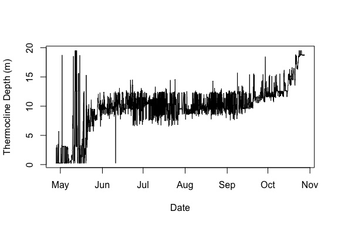

# Water temperature data in rLakeAnalyzer
Corinna Gries  
Thursday, October 23, 2014  

Introduction
------------

The goal of this script is to load a time series of water temperature at different water depth and run a few example statistics. The to be loaded was previously optained from either the GLEON CUAHSI sensor data repository or from the GLEON DataONE data product repository and formated in the respective scripts.

Timeseries files must follow a common format. The first column must have the label 'datetime' and be of the format yyyy-mm-dd HH:MM:SS (ISO 8601 without the "T" delimiter). The second can be skipped if not using sub-minute data. And the water temperature data columns must be sorted by increasing depth.

Set up
------

Install and load the package rLakeAnalyzer


```r
library(rLakeAnalyzer)
```

Load the data
-------------


```r
#path and file names for the two aggregated and rearranged tables
path.hourlysave <- 'Mendota2013widehourly.txt'
path.dailysave <- 'Mendota2013widedaily.txt'

#Load into RLakeAnalyzer
wrt.dailytemp = load.ts(path.dailysave)
wrt.hourlytemp = load.ts(path.hourlysave)

#explore the data tables
str(wrt.dailytemp)
```

```
## 'data.frame':	183 obs. of  24 variables:
##  $ datetime: POSIXct, format: "2013-04-27" "2013-04-28" ...
##  $ x0      : num  5.68 7.6 7.39 5.89 8.76 ...
##  $ x0.5    : num  5.43 5.97 6.94 5.6 7.1 ...
##  $ x1      : num  5.38 5.63 6.68 5.6 6.68 ...
##  $ x1.5    : num  5.41 5.6 6.52 5.71 6.49 ...
##  $ x2      : num  5.38 5.57 6.39 5.78 6.43 ...
##  $ x3      : num  4.94 5.25 6 5.64 6.18 ...
##  $ x4      : num  4.45 4.91 5.6 5.45 5.92 ...
##  $ x5      : num  4.51 4.95 5.5 5.59 6.02 ...
##  $ x6      : num  4.45 4.75 5.19 5.47 5.95 ...
##  $ x7      : num  4.41 4.62 4.94 5.32 5.87 ...
##  $ x8      : num  4.4 4.55 4.8 5.23 5.84 ...
##  $ x9      : num  4.45 4.57 4.76 5.21 5.86 ...
##  $ x10     : num  4.52 4.62 4.77 5.24 5.85 ...
##  $ x11     : num  4.46 4.55 4.67 5.16 5.78 ...
##  $ x12     : num  4.57 4.64 4.74 5.22 5.85 ...
##  $ x13     : num  4.47 4.54 4.62 5.09 5.72 ...
##  $ x14     : num  4.55 4.61 4.66 5.13 5.77 ...
##  $ x15     : num  4.65 4.71 4.74 5.19 5.86 ...
##  $ x16     : num  4.57 4.62 4.62 5.06 5.76 ...
##  $ x17     : num  4.51 4.55 4.54 4.95 5.68 ...
##  $ x18     : num  4.61 4.65 4.63 5 5.76 ...
##  $ x19     : num  4.49 4.54 4.51 4.85 5.67 ...
##  $ x20     : num  4.48 4.51 4.49 4.76 5.61 ...
```

```r
str(wrt.hourlytemp)
```

```
## 'data.frame':	4337 obs. of  24 variables:
##  $ datetime: POSIXct, format: "2013-04-27 21:00:00" "2013-04-27 22:00:00" ...
##  $ x0      : num  5.78 5.68 5.58 5.63 5.63 ...
##  $ x0.5    : num  5.52 5.42 5.35 5.42 5.46 ...
##  $ x1      : num  5.45 5.37 5.31 5.4 5.41 ...
##  $ x1.5    : num  5.46 5.41 5.36 5.49 5.48 ...
##  $ x2      : num  5.4 5.39 5.36 5.55 5.51 ...
##  $ x3      : num  4.87 4.95 5 5.32 5 ...
##  $ x4      : num  4.45 4.39 4.51 4.98 4.56 ...
##  $ x5      : num  4.51 4.48 4.53 4.97 4.56 ...
##  $ x6      : num  4.45 4.43 4.45 4.76 4.45 ...
##  $ x7      : num  4.43 4.41 4.4 4.58 4.37 ...
##  $ x8      : num  4.42 4.39 4.39 4.43 4.39 ...
##  $ x9      : num  4.49 4.44 4.43 4.43 4.43 ...
##  $ x10     : num  4.55 4.5 4.5 4.5 4.5 ...
##  $ x11     : num  4.47 4.46 4.44 4.43 4.42 ...
##  $ x12     : num  4.58 4.57 4.55 4.54 4.53 ...
##  $ x13     : num  4.5 4.47 4.44 4.44 4.44 ...
##  $ x14     : num  4.56 4.55 4.54 4.53 4.52 ...
##  $ x15     : num  4.67 4.64 4.63 4.63 4.62 ...
##  $ x16     : num  4.59 4.57 4.55 4.55 4.54 ...
##  $ x17     : num  4.52 4.51 4.49 4.48 4.47 ...
##  $ x18     : num  4.64 4.61 4.59 4.58 4.58 ...
##  $ x19     : num  4.49 4.5 4.48 4.48 4.46 ...
##  $ x20     : num  4.48 4.49 4.47 4.45 4.45 ...
```

```r
#make sure the files are sorted by date
attach(wrt.dailytemp)
wrt.dailysorted <- wrt.dailytemp[order(datetime),]
detach(wrt.dailytemp)

attach(wrt.hourlytemp)
wrt.hourlysorted <- wrt.hourlytemp[order(datetime),]
detach(wrt.hourlytemp)
```

Plot a heatmap for lake Mendoata in 2013
--------------------------------

 

Plot the buoyancy frequency for lake Mendota in 2013
----------------------------------------------------


```r
#calculate bouyancy on daily sorted data
N2 = ts.buoyancy.freq(wrt.dailysorted, seasonal=FALSE)
SN2 = ts.buoyancy.freq(wrt.dailysorted, seasonal=TRUE)
```
 

Plot the thermocline depth for lake Mendota in 2013
---------------------------------------------------


```r
#calculate the thermocline depth
t.d = ts.thermo.depth(wrt.hourlysorted)
```

 
